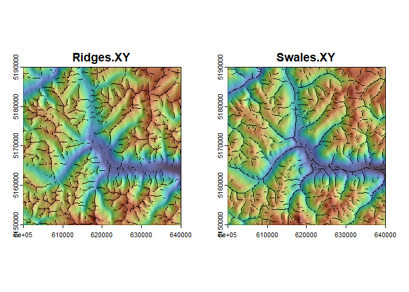

<!-- README.md is generated from README.Rmd. Please edit that file -->

# RSExtraction

<!-- badges: start -->
<!-- badges: end -->

The goal of RSExtraction is to provide a resource to perform analysis
presented in Lehner et al. (2024).

## Installation

You can install the development version of RSExtraction from
[GitHub](https://github.com/) with:

``` r
# install.packages("pak")
pak::pak("jacoblehner/RSExtraction")
```

## Example

This is a basic example which shows you how to solve a common problem:

``` r
library(RSExtraction)

f <- system.file("ex/elev_vinschgau.tif", package="terra")
r <- terra::rast(f)
a <- terra::disagg(r, 2.5)
r1 <- terra::resample(r, a, "bilinear")

# Extract morph
morph <- UV.RS.extract(inRas = r1, win = 5, rm.S = TRUE)

uv.List <- morph$Unit.Vectors
rs.List <- morph$RS.Morph

# Visualize unit vector surfaces
terra::plot(uv.List$uv.Rasts, col=gray(1:200/200), legend = FALSE)
```


``` r

# Visualize ridge and swale features
par(mfrow=c(1,2))
<<<<<<< HEAD
terra::plot(uv.List$uv.Rasts$nX, col= grDevices::gray(1:255/255), legend = FALSE, main = "Ridges.XY", xlim=c(610000,630000), ylim=c(5160000,5180000))
terra::plot(uv.List$uv.Rasts$AvgEl, col= viridis::turbo(255, alpha=0.5), legend = FALSE, add = TRUE)
terra::plot(rs.List$rs.Rasts$r.XY, col='black', legend = FALSE, add = TRUE)

terra::plot(uv.List$uv.Rasts$nX, col= grDevices::gray(1:255/255), legend = FALSE, main = "Swales.XY", xlim=c(610000,630000), ylim=c(5160000,5180000))
=======
terra::plot(uv.List$uv.Rasts$nX, col= grDevices::gray(1:255/255), legend = FALSE, main = "Ridges.XY")
terra::plot(uv.List$uv.Rasts$AvgEl, col= viridis::turbo(255, alpha=0.5), legend = FALSE, add = TRUE)
terra::plot(rs.List$rs.Rasts$r.XY, col='black', legend = FALSE, add = TRUE)

terra::plot(uv.List$uv.Rasts$nX, col= grDevices::gray(1:255/255), legend = FALSE, main = "Swales.XY")
>>>>>>> 27bacf1788f587b4326c23b0658810fcf89bf25c
terra::plot(uv.List$uv.Rasts$AvgEl, col= viridis::turbo(255, alpha=0.5), legend = FALSE, add = TRUE)
terra::plot(rs.List$rs.Rasts$s.XY, col='black', legend = FALSE, add = TRUE)
```


