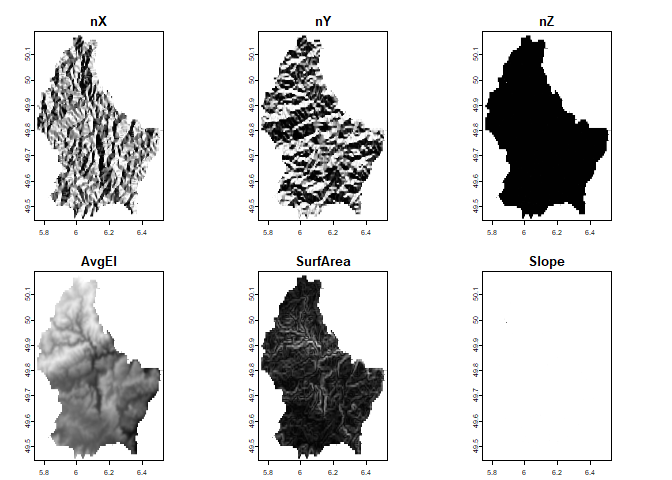

<!-- README.md is generated from README.Rmd. Please edit that file -->

# RSExtraction

<!-- badges: start -->
<!-- badges: end -->

The goal of RSExtraction is to provide a resource to perform analysis
presented in Lehner et al. (2024). Currently, this methodology is
developed for DEM datasets projected in UTM. Other coordinate systems
can be used, although the unit vector surfaces are unreliable due to the
discrepancy between lat/long degrees vs meters between the planar extent
and elevation values. Limited testing has shown that the ridge and swale
features extracted do not appear to be greatly affected and seem
reliable.

## Installation

You can install the development version of RSExtraction from
[GitHub](https://github.com/) with:

``` r
# install.packages("pak")
pak::pak("jacoblehner/RSExtraction")
```

## Example 1: WGS 84 / UTM zone 32N (EPSG:32632) coord. reference

``` r
library(RSExtraction)
library(terra)
#> terra 1.8.29
library(viridis)
#> Loading required package: viridisLite

f <- system.file("ex/elev_vinschgau.tif", package="terra")
r <- rast(f) 
a <- disagg(r, 2.5)
data <- resample(r, a, "bilinear")
plot(data, col=turbo(200), legend = T)
```


``` r

# Extract features
morph <- UV.RS.extract(inRas = data, win = 3, rm.S = TRUE)

uv.List <- morph$Unit.Vectors # unit vectors
rs.List <- morph$RS.Morph     # ridge-swale features

# Visualize unit vector surfaces
plot(uv.List$uv.Rasts, col = gray(1:200/200), 
     legend = FALSE, smooth = TRUE)
```


``` r

# Visualize ridge and swale features
par(mfrow=c(1,2))
plot(uv.List$uv.Rasts$nX, col = gray(1:255/255),
     xlim = c(610000,650000), ylim = c(5145000,5190000),
     legend = FALSE, main = "Ridges.XY")
plot(uv.List$uv.Rasts$AvgEl, col = turbo(255, alpha = 0.5), legend = FALSE, add = TRUE)
plot(rs.List$rs.Rasts$r.XY, col = 'black', legend = FALSE, add = TRUE)

plot(uv.List$uv.Rasts$nX, col = gray(1:255/255),
     xlim = c(610000,650000), ylim = c(5145000,5190000),
     legend = FALSE, main = "Swales.XY")
plot(uv.List$uv.Rasts$AvgEl, col = turbo(255, alpha = 0.5), legend = FALSE, add = TRUE)
plot(rs.List$rs.Rasts$s.XY, col = 'black', legend = FALSE, add = TRUE)
```


## Example 2: lon/lat WGS 84 (EPSG:4326) coord. reference

``` r
library(RSExtraction)
library(terra)
library(viridis)

f <- system.file("ex/elev.tif", package="terra")
r <- rast(f) 
<<<<<<< HEAD
a <- disagg(r, 5)
=======
a <- disagg(r, 2.5)
>>>>>>> 61e0230249544e18bef4cb6895afe4ab623a9ef9
data <- resample(r, a, "bilinear")
plot(data, col=turbo(200), legend = T)
```


``` r

# Extract features
morph <- UV.RS.extract(inRas = data, win = 3, rm.S = TRUE)

uv.List <- morph$Unit.Vectors # unit vectors
rs.List <- morph$RS.Morph     # ridge-swale features

# Visualize unit vector surfaces
plot(uv.List$uv.Rasts, col = gray(1:200/200), 
     legend = FALSE, smooth = TRUE)
```



``` r

# Visualize ridge and swale features
par(mfrow=c(1,2))
plot(uv.List$uv.Rasts$nX, col = gray(1:255/255),
     legend = FALSE, main = "Ridges.XY")
plot(uv.List$uv.Rasts$AvgEl, col = turbo(255, alpha = 0.5), legend = FALSE, add = TRUE)
plot(rs.List$rs.Rasts$r.XY, col = 'black', legend = FALSE, add = TRUE)

plot(uv.List$uv.Rasts$nX, col = gray(1:255/255),
     legend = FALSE, main = "Swales.XY")
plot(uv.List$uv.Rasts$AvgEl, col = turbo(255, alpha = 0.5), legend = FALSE, add = TRUE)
plot(rs.List$rs.Rasts$s.XY, col = 'black', legend = FALSE, add = TRUE)
```


